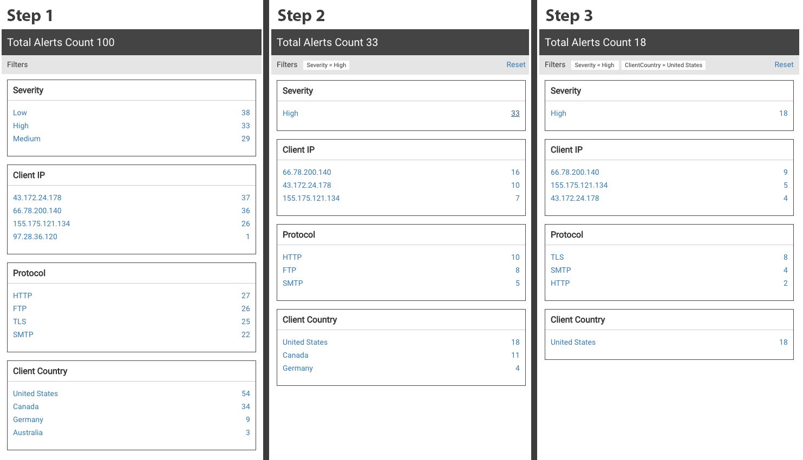

# Greetings!

Thanks for your interest in **Fidelis Cybersecurity**. As part of our evaluation process, we would like to compare apples to apples and give every candidate the same chance to unleash their creativity and demonstrate their awesome coding skills.

This coding Challenge allows you to choose whatever JS library, CSS framework, or building tools you like to create a simple application. We just want to get a sense of how you solve problems and a feel for the type of code you write.

Your time is precious, and we understand that this is an investment. We created a short version of our UI Challenge which should be finished within one hour.

Preferably your application is written in Angular, but any other solution is also acceptable. Create a zip file or provide a GitHub repo link with your final solution containing a readme with instructions on installing and running the application.

## The Challenge
The Fidelis Elevate Platform empowers cybersecurity professionals to collect information about their network environment and detect advanced threats.

This challenge aims to create a component that displays vital alert data statistics to the security analyst. Use the [alerts.json](alerts.json) file as the source for your data and create a reusable component to show the unique values and counts for Severity, Client IP, Protocol, and Client Country. If the analyst decides to narrow down his search by clicking on one of the counts, the counts should be accordingly filtered and the display updated.

The [ui-challenge-short.png](ui-challenge-short.png) demonstrates how the data should be displayed.

### Required Features
- Use [alerts.json](alerts.json) as your data source. Loading via ajax is optional.
- Create a reusable component to display statistical data blocks for Severity, Client IP, Protocol, and Client Country (See [ui-challenge-short.png](ui-challenge-short.png)).
- Clicking on a count value (blue text) should filter the data, and all blocks should display updated information.

### Bonus features
- Display the current total alert count at the top.
- When a filter is selected, display a reset button to clear all filters.
- When a filter is selected, display the status of currently applied filters.

___

### Basic unit test
To check if you did everything correctly you can verify your filter logic. 
Take a look at Steps 2 and Step 3. [Step 2](ui-challenge-short.png) displays 
the counts filtered by **"Severity = High"**. [Step 3](ui-challenge-short.png) 
displays the counts filtered by **"Severity = High"** and **"ClientCountry = United States"**. 
You don't need to write unit tests. 

___

## Final Notes

- Again, we use Angular and Bootstrap, but feel free to use whatever tool, framework, or library you feel comfortable with.
- Feel free to ask if you have any questions about the requirements or the challenge
- You can discuss this with anyone you want or use google as much as you need, but **you** must write the code, and **you** have to be able to explain why you made certain implementation decisions.
